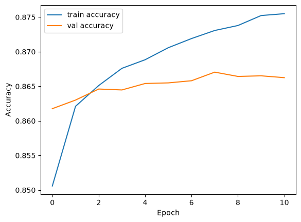
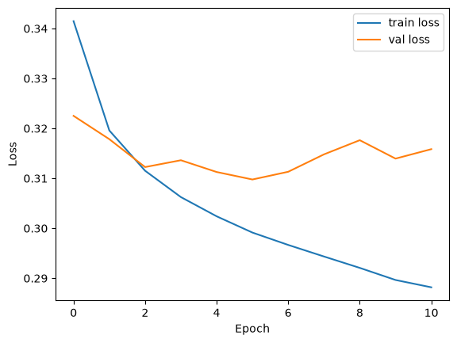
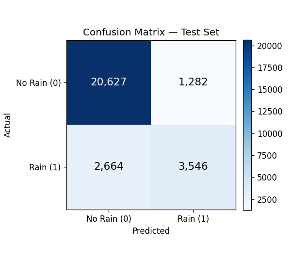

# Rain Tomorrow Prediction — Neural Network (Australia Weather)

A binary classification project that predicts whether it will rain tomorrow (`RainTomorrow`) using historical weather observations from 49 locations across Australia. Built as a first hands-on neural network project with Keras/TensorFlow.

## Dataset

- **Source:** [weatherAUS.csv](https://www.kaggle.com/datasets/jsphyg/weather-dataset-rattle-package) — ~10 years (2008–2017) of daily weather observations from the Australian Bureau of Meteorology.
- **Size:** 145,460 rows × 23 columns (raw).
- **Target:** `RainTomorrow` (Yes/No) — whether it rained the following day.

## Methodology

### 1. Exploratory Data Analysis
- Checked missing-value rates per column (some columns, e.g. `Sunshine`, `Cloud9am/3pm`, were 38–48% empty).
- Measured correlation of each feature with the target to prioritize which sparse columns were worth keeping vs. dropping.

### 2. Feature Engineering & Cleaning
| Step | Decision | Reasoning |
|---|---|---|
| `Evaporation` | Dropped | Weak correlation with target (-0.12) + high missingness (43%) |
| `Temp9am`, `Temp3pm`, `Pressure9am` | Dropped | Highly correlated (0.86–0.98) with `MaxTemp`/`Pressure3pm`, largely redundant |
| `TempRange` | Created (`MaxTemp - MinTemp`) | Stronger signal (corr ≈ -0.34) than any single raw temp column — diurnal range is a meaningful meteorological indicator |
| `Sunshine`, `Cloud9am/3pm`, and other numeric columns | Imputed via `Location + Month` group median | Captures regional/seasonal patterns better than a single global median |
| `WindGustDir`, `WindDir9am`, `WindDir3pm` | Imputed via `Location + Month` group mode, then encoded as sin/cos of compass angle | Wind direction is cyclical (N and NNW are adjacent, not distant); sin/cos preserves that circularity |
| `Date` (month) | Encoded as sin/cos of month | Same cyclical reasoning (December and January are adjacent) |
| `Location` | One-hot encoded (49 categories) | No ordinal relationship between locations |
| `RainToday`, `RainTomorrow` | Mapped Yes/No → 1/0 | Numeric input required for the network |
| Rows with missing `RainTomorrow` or `RainToday` | Dropped (~4.6k rows total) | No reliable way to recover/impute the label without introducing bias |

Final feature set: **73 columns** after encoding.

### 3. Train/Test Split
Split **chronologically** (not randomly) — last ~20% of dates held out as the test set (cutoff: 2015-11-10). This simulates the real-world scenario of training on the past and predicting the future, and avoids leaking future information into training.

- Train: 112,668 rows
- Test: 28,119 rows

### 4. Scaling
`StandardScaler` fit **only on the training set**, then applied to both train and test, to avoid data leakage. Applied only to continuous numeric columns (temperature, humidity, pressure, etc.) — one-hot and sin/cos columns were left untouched since they're already in a bounded, meaningful range.

### 5. Model Architecture

```
Input (73 features)
  → Dense(64, activation='relu')
  → Dense(32, activation='relu')
  → Dense(1, activation='sigmoid')
```

- **Loss:** `binary_crossentropy`
- **Optimizer:** `adam`
- **Regularization:** `EarlyStopping` (`monitor='val_loss'`, `patience=5`, `restore_best_weights=True`) to prevent overfitting
- **Total parameters:** 6,721

## Training

The model was set up to train for up to 50 epochs, but `EarlyStopping` halted training at **epoch 11**, once validation loss stopped improving for 5 consecutive epochs (best validation loss was reached around epoch 6; the final model weights were restored from that point).

<p align="center">
  
  
</p>

Training accuracy kept climbing after epoch 6 while validation accuracy/loss plateaued and slightly worsened — a sign the model was starting to overfit, which is exactly what `EarlyStopping` + `restore_best_weights` is designed to catch and correct for.

## Results

Evaluated on the held-out (chronological) test set:

| Metric | Score |
|---|---|
| Test accuracy | 86.0% |
| Test loss | 0.327 |

**Confusion matrix:**

<p align="center">
  
</p>

**Classification report:**

| Class | Precision | Recall | F1-score | Support |
|---|---|---|---|---|
| No rain (0) | 0.89 | 0.94 | 0.91 | 21,909 |
| Rain (1) | 0.73 | 0.57 | 0.64 | 6,210 |

**Note on class imbalance:** The dataset is imbalanced (~76% "No rain" days), so overall accuracy alone is not fully representative. The model performs noticeably better at identifying non-rainy days (recall 0.94) than rainy days (recall 0.57) — a common pattern in imbalanced classification that could be improved with techniques like class weighting, oversampling (SMOTE), or threshold tuning.

## Repository Structure

```
.
├── Week9-Case.ipynb      # Main notebook: cleaning, feature engineering, model, evaluation
├── weatherAUS.csv        # Dataset (not included — see Dataset section for source)
├── README.md
└── images/
    ├── accuracy_plot.png
    ├── loss_plot.png
    └── confusion_matrix.png
```

## How to Run

```bash
pip install pandas numpy scikit-learn tensorflow matplotlib
jupyter notebook Week9-Case.ipynb
```

Place `weatherAUS.csv` in the same directory as the notebook before running.

## Requirements

- Python 3.9+
- pandas
- numpy
- scikit-learn
- tensorflow / keras
- matplotlib

## Possible Improvements

- Address class imbalance (class weights, SMOTE, or adjusting the decision threshold below 0.5 to boost rain-day recall)
- Hyperparameter tuning (layer sizes, dropout, learning rate)
- Try alternative architectures or gradient-boosted tree baselines (XGBoost/LightGBM) for comparison
- Cross-validation with multiple chronological folds instead of a single split
