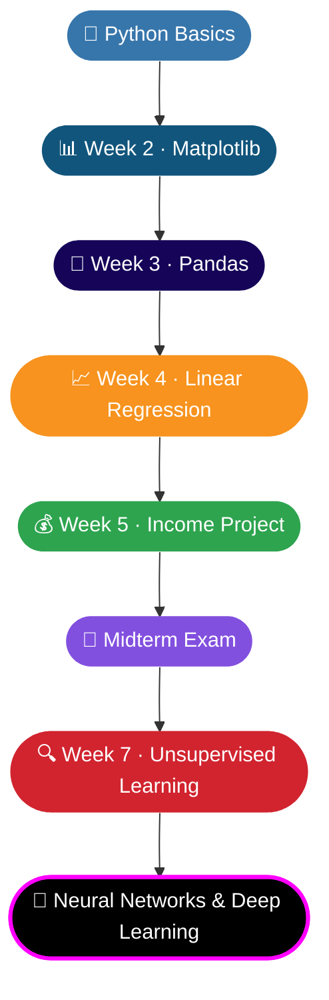
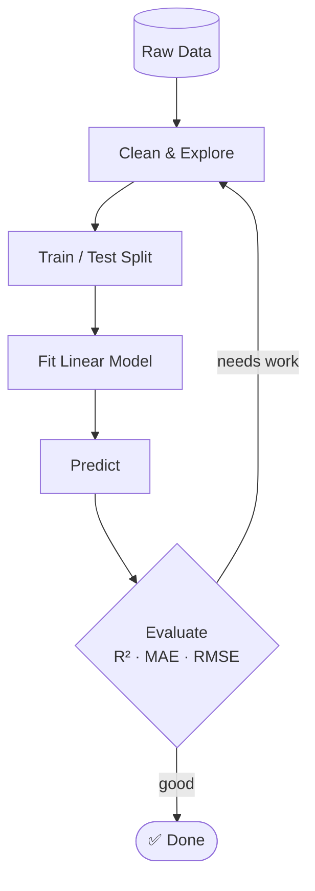

<div align="center">

# 🧠 QSS Intern Learning Journey

### From `print("Hello World")` to Neural Networks — a 3-month Python & Deep Learning path


*A hands-on collection of notebooks documenting everything I learn during my internship at **QSS** — data analysis, visualization, machine learning, and (next up) deep learning.*

</div>

---

## 📑 Table of Contents

- [About](#-about)
- [Learning Roadmap](#-learning-roadmap)
- [Projects](#-projects)
- [Repository Structure](#-repository-structure)
- [Tech Stack](#-tech-stack)
- [Getting Started](#-getting-started)

---

## 🎯 About

I started this internship with **Python fundamentals**, and each week adds a new layer: first data handling, then visualization, then machine learning models. This repository is my learning log — every folder or notebook is a small project where I apply a new concept to a real dataset.

**The goal:** build a solid foundation in the data science pipeline so I can move confidently into **neural networks and deep learning**.

---

## 🗺️ Learning Roadmap


```mermaid
flowchart TB
    A([🐍 Python Basics]) --> B([📊 Week 2 · Matplotlib])
    B --> C([🐼 Week 3 · Pandas])
    C --> D([📈 Week 4 · Linear Regression])
    D --> E([💰 Week 5 · Income Project])
    E --> F([📝 Midterm Exam])
    F --> G([🔍 Week 7 · Unsupervised Learning])
    G --> H([🧠 Neural Networks & Deep Learning])

    style A fill:#3776AB,color:#fff,stroke:none
    style B fill:#11557C,color:#fff,stroke:none
    style C fill:#150458,color:#fff,stroke:none
    style D fill:#F7931E,color:#fff,stroke:none
    style E fill:#2ea44f,color:#fff,stroke:none
    style F fill:#8250df,color:#fff,stroke:none
    style G fill:#d1242f,color:#fff,stroke:none
    style H fill:#000,color:#fff,stroke:#f0f,stroke-width:3px
```

---

## 🚀 Projects

### 📊 Week 2 — Data Visualization with Matplotlib
📓 [`Week2-Matplot.ipynb`](Week2-Matplot.ipynb)

My first step into visual storytelling. Numbers are hard to read, but a good chart tells the story instantly.

- Line, bar, scatter, and histogram plots
- Customizing titles, labels, legends, colors, and figure sizes
- Subplots and comparing multiple datasets on one canvas

---

### 🐼 Week 3 — Data Analysis with Pandas
Learning to load, clean, filter, group, and summarize real-world data — practiced on four different notebooks:

| Notebook | Dataset | What I practiced |
|----------|---------|------------------|
| [`Week3-Pandas.ipynb`](Week3-Pandas.ipynb) | Pandas fundamentals | `Series`, `DataFrame`, indexing, `loc` / `iloc`, filtering |
| [`Week3-Pandas-Titanic.ipynb`](Week3-Pandas-Titanic.ipynb) | 🚢 Titanic passengers | Missing values, `groupby`, survival analysis by class / gender / age |
| [`Week3-Pandas-Netflix.ipynb`](Week3-Pandas-Netflix.ipynb) | 🎬 Netflix titles | Exploring movies vs. TV shows, genres, countries, release trends |
| [`Week3-Pandas-HarryPotter.ipynb`](Week3-Pandas-HarryPotter.ipynb) | ⚡ Harry Potter data | Text-based data exploration, sorting, counting, and aggregation |

---

### 📈 Week 4 — Linear Regression (my first ML model!)
Where data analysis turns into **prediction**.

| Project | Description |
|---------|-------------|
| [`Week4-LinearRegression/`](Week4-LinearRegression) | Core linear regression workflow: train/test split → fit → predict → evaluate |
| [`Week4-LinearRegression_Another_Data/`](Week4-LinearRegression_Another_Data) | Same pipeline applied to a **different dataset** to test that the approach generalizes |
| [`HousePrices-LinearRegression.ipynb`](HousePrices-LinearRegression.ipynb) | 🏠 Predicting house prices from features such as size, location, and rooms |

**Key concepts:** features vs. target · train/test split · model fitting · R² score · MAE / MSE / RMSE · residuals


```mermaid
flowchart TB
    A[(Raw Data)] --> B[Clean & Explore]
    B --> C[Train / Test Split]
    C --> D[Fit Linear Model]
    D --> E[Predict]
    E --> F{Evaluate<br/>R² · MAE · RMSE}
    F -- needs work --> B
    F -- good --> G([✅ Done])
```

---

### 💰 Week 5 — Income Homework
📁 [`Week5-Income-HomeWork/`](Week5-Income-HomeWork)

An end-to-end assignment on **income data**: exploring the dataset, finding which factors matter, and building a predictive model on top of it.

---

### 📝 Midterm Exam
📁 [`Week_midterm_exam/`](Week_midterm_exam)

A combined test of everything from the first weeks — Python, Pandas, visualization, and regression in one project.

---

### 🔍 Week 7 — Unsupervised Learning
📁 [`w7_Unsupervised/`](w7_Unsupervised)

A shift in mindset: **no labels, no target — let the algorithm find the structure.**

- Clustering to group similar data points
- Dimensionality reduction to visualize high-dimensional data
- Interpreting the discovered groups

| | 🎯 Supervised Learning | 🔍 Unsupervised Learning |
|---|---|---|
| **Weeks** | Weeks 4–5 | Week 7 |
| **Data** | Has labels (a target to predict) | No labels |
| **Goal** | Predict a value | Find hidden structure |
| **Example** | Linear Regression | Clustering, Dimensionality Reduction |

> 🧠 **Next:** Deep Learning

---

## 🗂️ Repository Structure

```text
QssInternLearning/
│
├── 📓 Week2-Matplot.ipynb                     # Data visualization
├── 📓 Week3-Pandas.ipynb                      # Pandas basics
├── 📓 Week3-Pandas-Titanic.ipynb              # Titanic analysis
├── 📓 Week3-Pandas-Netflix.ipynb              # Netflix analysis
├── 📓 Week3-Pandas-HarryPotter.ipynb          # Harry Potter data analysis
├── 📓 HousePrices-LinearRegression.ipynb      # House price prediction
│
├── 📁 Week4-LinearRegression/                 # Linear regression project
├── 📁 Week4-LinearRegression_Another_Data/    # Same method, new dataset
├── 📁 Week5-Income-HomeWork/                  # Income data assignment
├── 📁 Week_midterm_exam/                      # Midterm project
└── 📁 w7_Unsupervised/                        # Clustering & unsupervised learning
```

---

## 🧰 Tech Stack

| Category | Tools |
|----------|-------|
| **Language** | Python |
| **Environment** | Jupyter Notebook |
| **Data handling** | Pandas, NumPy |
| **Visualization** | Matplotlib (and Seaborn where useful) |
| **Machine Learning** | scikit-learn |
| **Version control** | Git & GitHub |

---

## ⚙️ Getting Started

**1. Clone the repository**

```bash
git clone https://github.com/uzeyirelivasli/QssInternLearning.git
cd QssInternLearning
```

**2. Create a virtual environment (recommended)**

```bash
python -m venv venv

# Windows
venv\Scripts\activate
# macOS / Linux
source venv/bin/activate
```

**3. Install dependencies**

```bash
pip install jupyter pandas numpy matplotlib seaborn scikit-learn
```

**4. Launch Jupyter**

```bash
jupyter notebook
```

Open any `.ipynb` file and run the cells from top to bottom. 🎉

---

<div align="center">

⭐ If you find this repo useful, feel free to give it a star!

</div>
