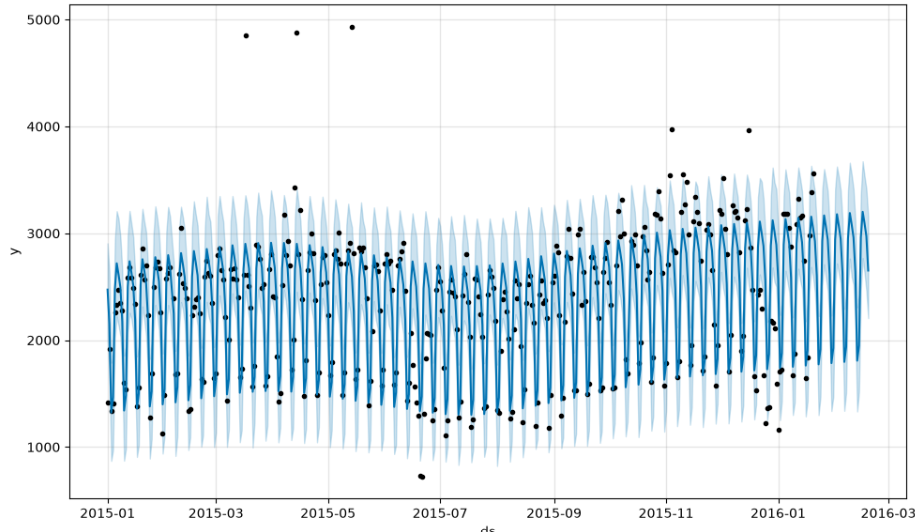
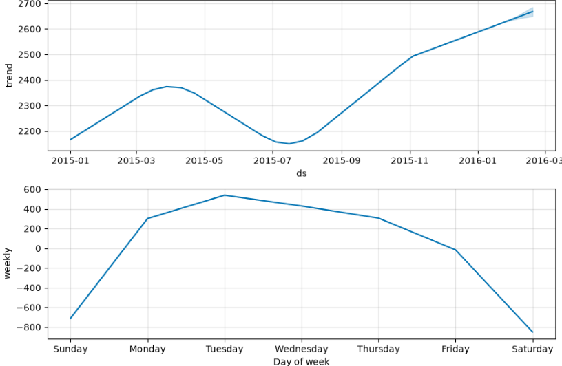

# 📈 Wikipedia Views Forecasting — Prophet

Forecasting daily page views of the [Machine Learning Wikipedia article](https://en.wikipedia.org/wiki/Machine_learning) using **Facebook Prophet**.


## 🎯 Project Overview

Daily view counts of a Wikipedia page (Jan 2015 – Jan 2016, ~383 days) are used to forecast the **next 30 days** of traffic using Prophet, an additive regression model (trend + seasonality).

## 📊 Results

<p align="center">
  
</p>

<p align="center">
  
</p>

> The model captures a clear **weekly seasonality** pattern (weekday vs. weekend reading behavior) in addition to the overall upward trend.

## 🗂️ Dataset

`wiki_machine_learning.csv` — daily read counts for the Machine Learning Wikipedia page.

| Column | Description |
|---|---|
| `date` | Day of observation |
| `count` | Number of page reads (target variable) |
| `lang`, `page`, `rank`, `month`, `title` | Metadata (not used in modeling) |

**Preprocessing:** rows with `count == 0` are treated as missing values and removed.

## ⚙️ Setup

```bash
git clone https://github.com/<your-username>/wiki-views-forecast.git
cd wiki-views-forecast
pip install -r requirements.txt
```

`requirements.txt`
```
pandas
matplotlib
prophet
```

## 🚀 Usage

```bash
jupyter notebook Prophet_NN.ipynb
```

Run the notebook top to bottom:
1. Load & clean the data (`df_cleaned`)
2. Fit **Prophet**
3. Forecast the next 30 days
